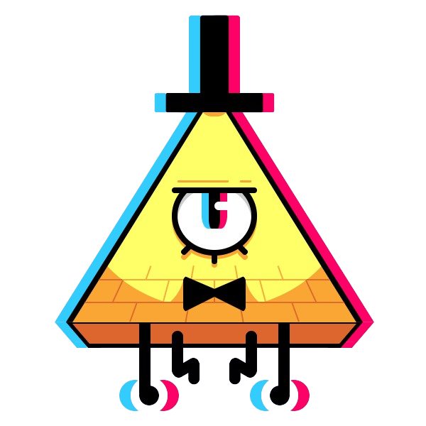
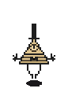
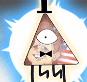
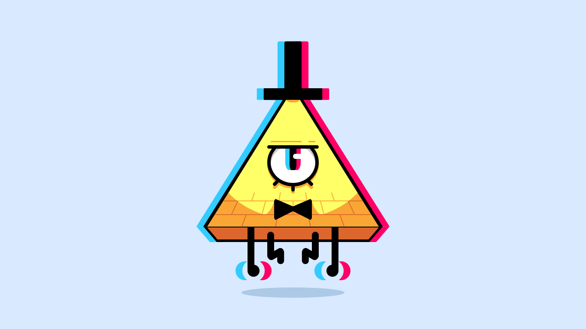
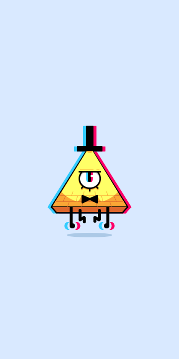

<h1 align="center">
    
</h1>
<h4 align="center">Bill Cipher Illustration. (Gravity Falls)</h4>
<p align="center">
    
    </img>
    
    <a href="https://github.com/CSS-Drawings/BillCipher/blob/master/LICENSE">
        
    </a>
    <a href="https://picpay.me/Matheus_nyctibius_vii">
        
    </a>
</p>
<p align="center">
    <a href="#bill-cipher-">Projeto</a>&nbsp;&nbsp;&nbsp;|&nbsp;&nbsp;&nbsp;
    <a href="#tecnologias-">Tecnologias</a>&nbsp;&nbsp;&nbsp;|&nbsp;&nbsp;&nbsp;
    <a href="#layout-">Layout</a>&nbsp;&nbsp;&nbsp;|&nbsp;&nbsp;&nbsp;
    <a href="#licença-%EF%B8%8F">Licença</a>
</p>
<!--
<p align="center">
    <a href="README.md">Inglês</a>
    ·
    <a href="README-pt.md">Português</a>
</p>
-->

# Bill Cipher 🔮
Projeto desenvolvido para treinamento e aprendizado de técnicas CSS. 



- 🗻 Personagem: "Bill Cipher",
- 🧿 Inspiração: "Olho da Providência",
- ☄ Criatura №: 326,
- 🧠 Espécies: "Demônio dos sonhos",
- ⚡ Meta: "Para governar toda a realidade e existência.",
- 🌌 Casa: "Dimensão bidimensional sem nome (anteriormente) Nightmare Realm",
- 🎭 Citar: "Lembre-se! A realidade é uma ilusão, o universo é um holograma, compre ouro, Tchau!",
- ☣ Ritual de convocação: "Triangulum, Entangulum. Meteforis Dominus Ventium. Meteforis Venetisarium!"

<br>

#### Funcionalidades 🎩
* Ilustração com css.
* Animações.
* Responsividade.

<br>

## Tecnologias 🚀
Esse projeto foi desenvolvido com as seguintes tecnologias:
- [Html | 5](https://developer.mozilla.org/pt-BR/docs/Web/HTML)
- [Css | 3](https://developer.mozilla.org/pt-BR/docs/Web/CSS)
- [NodeJS | ^14.16.1](https://nodejs.org/en/)

## Layout 🚧
### Desktop Screenshot
<div style="display: flex; flex-direction: 'column'; align-items: 'center';">
<!-- Responsive, 1440 x 900, 50% (Laptop L - 1440px)-->
    
</div>

### Mobile Screenshot
<div style="display: flex; flex-direction: 'row';">
<!-- Responsive, 425 x 900, 60% (Mobile L - 425px)-->
    
</div>


## Rodando o projeto 🚴🏻‍♂️
#### "Só vou dar uma olhadinha...":
  <a href="https://bill-cipher.herokuapp.com/">🔮 Site hospedado no Heroku 🎩</a>

#### Na sua maquina:
<details>
    <summary>Dependências</summary>

```json
    "devDependencies": {
      "nodemon": "^2.0.7"
    },
    "dependencies": {
      "express": "^4.17.1"
    }
    //Ex: $ npm install @types/_____ -D
```
</details>

<details>
    <summary>Engines</summary>

```json
    "engines": {
      "node": "14.16.1",
      "npm": "6.14.12"
    }
```
</details>

```bash
# Clone o repositório
$ git clone https://github.com/CSS-Drawings/BillCipher.git

# Acesse a pasta do projeto no prompt de comando
$ cd BillCipher

# Instale as dependências
$ npm install

# Execute o script "dev"
$ npm run dev

# O projeto inciará na porta: 5000 - acesse http://localhost:5000
```

## Contribuição 💭
As contribuições são o que tornam a comunidade de código aberto um lugar incrível para aprender, inspirar e criar. Quaisquer contribuições que você fizer serão **muito apreciadas**.

1. Faça **fork** do projeto
2. Crie seu my-feature **Branch** ```$ git checkout -b my-feature```
3. Faça **commit** de suas alterações ```$ git commit -m 'Added some features'```
4. Envie para o **Branch** ```$ git push origin my-feature```
5. Abra um **pull request**

## Licença ⚖️
Este projeto está sob a licença do MIT. Veja o arquivo [LICENSE](https://github.com/CSS-Drawings/BillCipher/blob/master/LICENSE) para mais detalhes.

## Contato ✉️
| <br><sub><a href="https://www.instagram.com/nyctibius_vii/?hl=pt-br">@MatheusVidigal🦊</a></sub> |
| :---: |

<p align="left">
    <a href="https://www.linkedin.com/in/matheus-vidigal-nyctibiusvii/">
        
    </a>
    <a href="https://mail.google.com/mail/u/1/#inbox?compose=GTvVlcSGLCKpKJfwPsKKqzXBplKkGtCLvCQcFWdWxCxQFfkHzzjVkgzrMFPBgKBmWFHvrjrCsMqSH">
        
    </a>
</p>